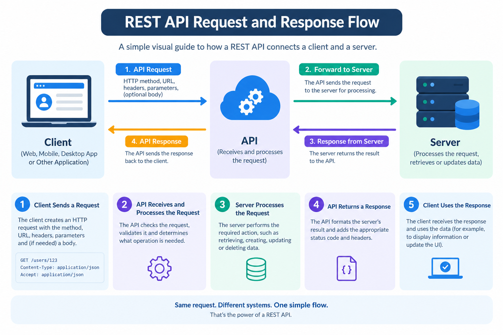

# Getting Started with REST APIs

REST APIs are widely used to allow different software applications and services to communicate with each other.

If you have used a mobile application, online shopping website, banking application, or weather app, there is a good chance that APIs are working behind the scenes.

This guide introduces the basic concepts of REST APIs and explains how a typical API request works.

## What Is an API?

API stands for **Application Programming Interface**.

An API provides a defined way for different software applications to communicate with each other.

Instead of one application directly accessing another application's internal code or database, it can use an API to request information or perform an action.

### Real-World Example

Imagine that you are using a weather application.

The weather application needs information such as:

- Current temperature
- Weather conditions
- Humidity
- Wind speed

The application could request this information from a weather service through an API.

The basic communication looks like this:

~~~text
Weather App → API Request → Weather Server
Weather App ← API Response ← Weather Server
~~~

The application does not need to know how the weather service stores or calculates its data. It only needs to know how to communicate with the API.

This separation makes it easier for different systems to work together.

## How Does an API Work?

A typical API interaction involves a **client**, an **API**, and a **server**.

The client sends a request to the API.

The API receives the request and determines what operation is required.

The server then processes the request and returns the result.

The API sends the response back to the client.

The process can be summarized as:

~~~text
Client
   |
   | Request
   ↓
API
   |
   | Process request
   ↓
Server
   |
   | Response
   ↓
Client
~~~

For example, a web application may request information about a customer.

~~~http
GET /customers/123
~~~

The server processes the request and may return:

~~~json
{
  "id": 123,
  "name": "John Smith",
  "email": "john@example.com"
}
~~~

The web application can then use this information to display the customer's details.

## What Is a REST API?

REST stands for **Representational State Transfer**.

REST is an architectural style used for designing networked applications.

A REST API commonly uses HTTP to allow clients to interact with resources on a server.

REST APIs are popular because they provide a simple and standardized way for applications to communicate.

For example:

~~~http
GET /users/123
~~~

This request asks the API to retrieve information about user `123`.

A successful response might be:

~~~json
{
  "id": 123,
  "name": "John Smith",
  "email": "john@example.com"
}
~~~

The client can then process the returned information.

## REST API Request Flow

The following diagram shows a simplified REST API communication flow.

*Figure 1: A simplified REST API request and response workflow.*

A typical interaction follows these four steps:

1. The client creates a request.
2. The API receives and processes the request.
3. The server performs the required operation.
4. The API returns a response to the client.

## What Is a Client?

The **client** is the application or system that sends a request to an API.

Common examples include:

- Web applications
- Mobile applications
- Desktop applications
- API testing tools
- Other backend services

For example, when you open a mobile banking application and request your account balance, the mobile application can act as the client.

The client does not necessarily need to know how the server stores the account information. It only needs to send a correctly formatted request.

## What Is a Server?

The **server** is the system that receives and processes an API request.

Depending on the request, the server might:

- Retrieve information from a database
- Create a new record
- Update existing information
- Delete a record
- Perform calculations
- Validate submitted information

After completing the requested operation, the server returns the result.

## What Is an API Request?

An **API request** is a message sent by a client to an API.

A request can contain several components.

### HTTP Method

The HTTP method tells the API what type of operation the client wants to perform.

Common methods include:

- GET
- POST
- PUT
- PATCH
- DELETE

For example:

~~~http
GET /users/123
~~~

The `GET` method indicates that the client wants to retrieve information.

HTTP methods are covered in more detail in the [HTTP Methods](http-methods.md) guide.

### Endpoint

An endpoint is a specific URL through which an API provides access to a resource or operation.

For example:

~~~text
/users
/users/123
/products
/orders
~~~

The endpoint `/users/123` could represent one specific user.

### Headers

Headers provide additional information about a request.

For example:

~~~http
Content-Type: application/json
Accept: application/json
~~~

Headers can communicate information about the request format, authentication, accepted response formats, and other requirements.

### Request Body

Some API requests include a request body.

For example, when creating a new user, the client might send:

~~~json
{
  "name": "John Smith",
  "email": "john@example.com"
}
~~~

The server can use this information to create the new user.

## What Is an API Response?

An **API response** is the result returned by the server after processing a request.

A response commonly contains:

- Status code
- Response headers
- Response body

For example:

~~~http
HTTP/1.1 200 OK
~~~

The response body could contain:

~~~json
{
  "id": 123,
  "name": "John Smith",
  "email": "john@example.com"
}
~~~

The status code tells the client what happened, while the response body usually contains the requested data or information about the result.

## What Are Resources?

REST APIs commonly work with **resources**.

A resource represents an object, collection, or piece of information that the API makes available.

Common resources include:

| Resource | Example Endpoint |
|---|---|
| Users | `/users` |
| Products | `/products` |
| Orders | `/orders` |
| Articles | `/articles` |
| Payments | `/payments` |

For example:

~~~text
/users
~~~

could represent a collection of users.

A specific user could be represented by:

~~~text
/users/123
~~~

The number `123` identifies a particular user.

## Collection vs. Individual Resource

It is useful to understand the difference between a collection and an individual resource.

A collection represents multiple resources:

~~~text
/users
~~~

An individual resource represents one specific item:

~~~text
/users/123
~~~

For example:

~~~http
GET /users
~~~

might return several users.

~~~http
GET /users/123
~~~

might return only the user with ID `123`.

## A Complete API Example

Suppose an application needs information about a user.

### Step 1: Send the request

The client sends:

~~~http
GET /users/123
~~~

### Step 2: API receives the request

The API identifies:

- The HTTP method: `GET`
- The requested resource: `users`
- The resource ID: `123`

### Step 3: Server processes the request

The server searches for the requested user.

If the user exists, the server prepares the requested information.

### Step 4: API returns the response

The API may return:

~~~http
200 OK
~~~

along with:

~~~json
{
  "id": 123,
  "name": "John Smith",
  "email": "john@example.com"
}
~~~

The client can then use the response.

## What Happens When a Request Fails?

Not every API request is successful.

For example, if the requested user does not exist, the API might return:

~~~http
404 Not Found
~~~

If the client sends invalid information, the API might return:

~~~http
400 Bad Request
~~~

If authentication is required but the client has not provided valid credentials, the API might return:

~~~http
401 Unauthorized
~~~

Common HTTP status codes include:

| Status Code | Meaning |
|---|---|
| `200 OK` | Request was successful |
| `201 Created` | A new resource was created |
| `400 Bad Request` | Request contains invalid information |
| `401 Unauthorized` | Authentication is required or invalid |
| `403 Forbidden` | Client does not have permission |
| `404 Not Found` | Requested resource does not exist |
| `500 Internal Server Error` | Server encountered an unexpected problem |

A complete explanation of status codes will be provided in the [Status Codes](status-codes.md) section.

## API Data and JSON

REST APIs commonly use **JSON**, or JavaScript Object Notation, to represent structured data.

For example:

~~~json
{
  "id": 123,
  "name": "John Smith",
  "email": "john@example.com"
}
~~~

JSON uses key-value pairs to represent information.

In this example:

- `id` identifies the user.
- `name` contains the user's name.
- `email` contains the user's email address.

JSON is popular because it is relatively easy for both humans and software applications to read and process.

## Key Terms

| Term | Definition |
|---|---|
| API | A defined way for software applications to communicate |
| REST | An architectural style used for networked applications |
| Client | The application that sends an API request |
| Server | The system that processes the request |
| Request | A message sent from a client to an API |
| Response | A message returned by the API |
| Resource | Data or an object exposed through an API |
| Endpoint | A URL used to access a resource or operation |
| HTTP | A protocol commonly used for web communication |
| JSON | A format commonly used to represent structured API data |

## Summary

A REST API provides a structured way for applications to communicate.

The basic process is:

1. A client sends a request.
2. The API receives the request.
3. The server processes the request.
4. The API returns a response.
5. The client uses the response.

Understanding these fundamentals makes it easier to work with API documentation, developer tools, and software integrations.

## What's Next?

Now that you understand the basic structure of a REST API, continue with **[HTTP Methods](http-methods.md)** to learn how `GET`, `POST`, `PUT`, `PATCH`, and `DELETE` are used to interact with API resources.
