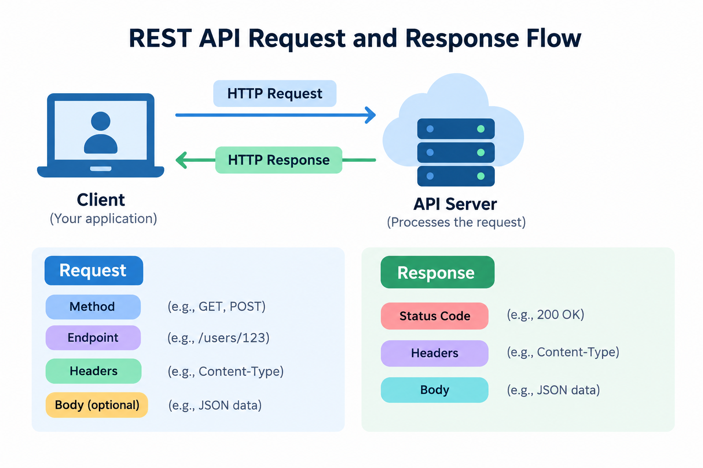

# Requests and Responses in REST APIs

REST APIs work through a simple communication process: a **client sends a request**, and a **server returns a response**.

The request tells the API what the client wants to do. The response tells the client what happened after the server processed that request.

Understanding the structure of requests and responses helps you send the correct data, interpret API results, and troubleshoot errors more effectively.

## The Request and Response Flow

A typical REST API interaction follows these steps:

1. The client sends an HTTP request.
2. The API receives and validates the request.
3. The server processes the requested operation.
4. The server creates a response.
5. The API sends the response back to the client.

For example:

```text
Client → HTTP Request → API Server
Client ← HTTP Response ← API Server
```

The request contains information about the operation the client wants to perform. The response contains information about the result.

You can also use the following visual to understand the relationship between a request and a response:



*Figure 1: A simplified REST API request and response flow.*

---

## What Is an API Request?

An **API request** is a message sent by a client to an API.

The request tells the server what resource the client wants to access and what action it wants to perform.

A request commonly contains:

- HTTP method
- Endpoint or URL
- Headers
- Query parameters
- Request body

Not every request contains all of these components.

For example, a simple request might look like:

```http
GET /users/123
```

This request asks the server to retrieve information about the user with ID `123`.

---

## Anatomy of an API Request

Consider the following request:

```http
POST /users
Content-Type: application/json
Authorization: Bearer your_access_token
```

Request body:

```json
{
  "name": "Sarah Lee",
  "email": "sarah@example.com"
}
```

This request contains several important components.

| Component | Example | Purpose |
|---|---|---|
| HTTP method | `POST` | Defines the requested operation |
| Endpoint | `/users` | Identifies the resource |
| Header | `Content-Type: application/json` | Describes the request data |
| Authorization | `Bearer your_access_token` | Provides authentication credentials |
| Request body | JSON user data | Contains information sent to the server |

Let's examine each component in more detail.

## HTTP Method

The **HTTP method** tells the server what action the client wants to perform.

Common HTTP methods include:

| Method | Purpose |
|---|---|
| `GET` | Retrieve information |
| `POST` | Create a resource |
| `PUT` | Replace a resource |
| `PATCH` | Partially update a resource |
| `DELETE` | Remove a resource |

For example:

```http
GET /users/123
```

retrieves a user, while:

```http
DELETE /users/123
```

asks the server to remove that user.

For more information, see the **[HTTP Methods](http-methods.md)** guide.

---

## Endpoint

An **endpoint** identifies the resource that the client wants to access.

For example:

```text
/users
```

might represent a collection of users.

A specific user could be represented by:

```text
/users/123
```

The same endpoint can sometimes be used with different HTTP methods.

```text
GET    /users/123
PUT    /users/123
PATCH  /users/123
DELETE /users/123
```

Although the endpoint is the same, each method requests a different operation.

---

## Request Headers

**Headers** provide additional information about an API request.

They are sent as key-value pairs.

Example:

```http
Content-Type: application/json
Accept: application/json
Authorization: Bearer your_access_token
```

Common request headers include:

| Header | Purpose |
|---|---|
| `Content-Type` | Describes the format of data sent to the server |
| `Accept` | Indicates the response format the client expects |
| `Authorization` | Sends authentication credentials |
| `User-Agent` | Identifies the application making the request |

### Content-Type

The `Content-Type` header describes the format of the request body.

For example:

```http
Content-Type: application/json
```

This tells the server that the client is sending JSON data.

---

## Query Parameters

**Query parameters** provide additional information within a URL.

They normally appear after a question mark (`?`).

For example:

```http
GET /products?category=laptops
```

Here:

- `/products` is the endpoint.
- `category` is the query parameter.
- `laptops` is the parameter value.

Multiple query parameters can be combined using an ampersand (`&`).

```http
GET /products?category=laptops&limit=10
```

An API might use these parameters to filter or limit the results.

Another example:

```http
GET /users?page=2&limit=20
```

This could request the second page of users and limit the response to 20 records.

> The exact query parameters available depend on the API.

---

## Request Body

The **request body** contains data sent from the client to the server.

Request bodies are commonly used with methods such as:

- `POST`
- `PUT`
- `PATCH`

For example:

```http
POST /users
Content-Type: application/json
```

Request body:

```json
{
  "name": "Sarah Lee",
  "email": "sarah@example.com"
}
```

The server can use this information to create a new user.

A `GET` request usually does not require a request body because it is mainly used to retrieve information.

---

## What Is an API Response?

An **API response** is the message returned by the server after processing a request.

A response commonly contains:

- HTTP status code
- Response headers
- Response body

For example:

```http
HTTP/1.1 200 OK
Content-Type: application/json
```

Response body:

```json
{
  "id": 123,
  "name": "John Smith",
  "email": "john@example.com"
}
```

The status code tells the client whether the request succeeded, while the response body contains the returned information.

---

## Anatomy of an API Response

Consider the following response:

```http
HTTP/1.1 201 Created
Content-Type: application/json
Location: /users/125
```

Response body:

```json
{
  "id": 125,
  "name": "Sarah Lee",
  "email": "sarah@example.com"
}
```

The response contains three main components.

| Component | Example | Purpose |
|---|---|---|
| Status code | `201 Created` | Indicates the result of the request |
| Response header | `Content-Type: application/json` | Provides information about the response |
| Response body | JSON user data | Contains the returned information |

---

## HTTP Status Code

The **HTTP status code** tells the client what happened when the server processed the request.

For example:

```http
200 OK
```

means the request was successful.

```http
201 Created
```

means a new resource was successfully created.

```http
404 Not Found
```

means the requested resource could not be found.

Common status codes include:

| Status Code | Meaning |
|---|---|
| `200 OK` | Request completed successfully |
| `201 Created` | Resource created successfully |
| `204 No Content` | Request succeeded with no response body |
| `400 Bad Request` | Request contains invalid or missing data |
| `401 Unauthorized` | Authentication is missing or invalid |
| `403 Forbidden` | Client does not have permission |
| `404 Not Found` | Requested resource does not exist |
| `500 Internal Server Error` | Server encountered an unexpected problem |

For more information, see the **[Status Codes](status-codes.md)** guide.

---

## Response Headers

Response headers provide additional information about the server's response.

For example:

```http
Content-Type: application/json
Content-Length: 85
```

Common response headers may include:

| Header | Purpose |
|---|---|
| `Content-Type` | Describes the response body format |
| `Content-Length` | Indicates the size of the response body |
| `Location` | May identify the location of a newly created resource |
| `Cache-Control` | Provides instructions for response caching |

The headers available depend on the API and server configuration.

---

## Response Body

The **response body** contains the data returned by the API.

REST APIs commonly return JSON.

Example:

```json
{
  "id": 123,
  "name": "John Smith",
  "email": "john@example.com"
}
```

A collection response may contain multiple objects.

```json
{
  "users": [
    {
      "id": 123,
      "name": "John Smith"
    },
    {
      "id": 124,
      "name": "Sarah Lee"
    }
  ]
}
```

However, some successful responses do not contain a response body.

For example:

```http
204 No Content
```

A `204` response indicates that the operation succeeded but there is no additional content to return.

---

## Complete Request and Response Example

Suppose a client wants to create a new user.

### Request

```http
POST /users
Content-Type: application/json
Authorization: Bearer your_access_token
```

Request body:

```json
{
  "name": "Sarah Lee",
  "email": "sarah@example.com"
}
```

### Response

The server processes the request and creates the user.

It may return:

```http
HTTP/1.1 201 Created
Content-Type: application/json
Location: /users/125
```

Response body:

```json
{
  "id": 125,
  "name": "Sarah Lee",
  "email": "sarah@example.com"
}
```

In this example:

- `POST` tells the API to create a resource.
- `/users` identifies the user collection.
- `Content-Type` tells the server that the request body contains JSON.
- `Authorization` provides authentication information.
- The JSON body contains the new user's information.
- `201 Created` confirms that the user was successfully created.
- The response body contains the newly created resource.

---

## Successful and Failed Responses

Not every API request succeeds.

### Successful Request

A successful request might return:

```http
200 OK
```

with:

```json
{
  "id": 123,
  "name": "John Smith"
}
```

### Failed Request

If the requested user does not exist, the server might return:

```http
404 Not Found
```

The response body could contain:

```json
{
  "error": "User not found"
}
```

Another API might return a more detailed error:

```json
{
  "error": {
    "code": "USER_NOT_FOUND",
    "message": "The requested user could not be found."
  }
}
```

The exact error format varies between APIs.

---

## Common Request and Response Examples

| Action | Request | Typical Response |
|---|---|---|
| Retrieve users | `GET /users` | `200 OK` |
| Retrieve one user | `GET /users/123` | `200 OK` |
| Create a user | `POST /users` | `201 Created` |
| Replace a user | `PUT /users/123` | `200 OK` |
| Partially update a user | `PATCH /users/123` | `200 OK` |
| Delete a user | `DELETE /users/123` | `204 No Content` |
| Request missing resource | `GET /users/999` | `404 Not Found` |

These are common patterns, but individual APIs may use slightly different response codes.

---

## Tips for Working with Requests and Responses

When working with an API, check each part of the request carefully.

### Check the HTTP Method

Make sure you are using the method expected by the API.

For example, using `POST` instead of `GET` could perform a completely different operation.

### Check the Endpoint

Verify that the endpoint is correct.

For example:

```text
/users/123
```

and:

```text
/user/123
```

may not represent the same endpoint.

### Check the Headers

Some APIs require specific headers, especially for authentication and content type.

For example:

```http
Authorization: Bearer your_access_token
```

### Validate the Request Body

When sending JSON, check that the syntax is valid.

Correct:

```json
{
  "name": "Sarah Lee",
  "email": "sarah@example.com"
}
```

Incorrect:

```text
{
  "name": "Sarah Lee"
  "email": "sarah@example.com"
}
```

The incorrect example is missing a comma between the fields.

### Always Check the Status Code

Do not rely only on the response body.

The status code provides important information about whether the operation succeeded.

### Read Error Messages

When an API returns an error, check both the status code and error message.

They often provide useful information for identifying the problem.

---

## Request vs. Response

The key difference is simple:

| Request | Response |
|---|---|
| Sent by the client | Sent by the server |
| Tells the API what to do | Tells the client what happened |
| Contains method and endpoint | Contains status code |
| May contain headers | Usually contains headers |
| May contain request body | May contain response body |

Remember:

```text
Request = What do I want the API to do?

Response = What happened after the API processed my request?
```

---

## Summary

REST API communication is based on requests and responses.

A request can contain:

- HTTP method
- Endpoint
- Headers
- Query parameters
- Request body

A response can contain:

- HTTP status code
- Response headers
- Response body

Understanding these components helps you read API documentation, build correct requests, interpret API results, and troubleshoot problems more effectively.

## What's Next?

Now that you understand how API requests and responses work, continue with **[Status Codes](status-codes.md)** to learn what common HTTP response codes mean and how they help identify successful and failed API operations.
